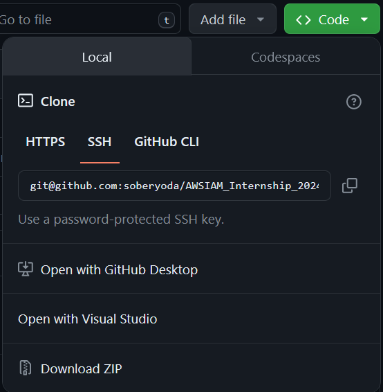

# Project Description 
<details><summary><b>Exercise</b></summary>
<div>
    
</div>
Exercise: 
Write a method verifying the input JSON data. Input data format is defined as AWS::IAM::Role Policy - definition and example (<a href="https://docs.aws.amazon.com/AWSCloudFormation/latest/UserGuide/aws-properties-iam-role-policy.html">AWS IAM Role JSON definition and example</a>). Input JSON might be read from a file. 
Method shall return logical false if an input JSON Resource field contains a single asterisk and true in any other case.

```diff
    {
    "PolicyName": "root",
    "PolicyDocument": {
        "Version": "2012-10-17",
        "Statement": [
            {
                "Sid": "IamListAccess",
                "Effect": "Allow",
                "Action": [
                    "iam:ListRoles",
                    "iam:ListUsers"
                ],
                "Resource": "*"
            }
        ]
    }
}
```
</details>
<details><summary><b>My Solution and observations</b></summary>
</details>

# Tech Stack:
<details><summary><b>Stack</b></summary>

<div>
	
	
	
</div>
<ul>
    <li>Java 17</li>
    <li>Maven 3 (Version 3.8.1)</li>
    <li>JUnit 4.13.2, junit.jupiter 5.10.2</li>
    <li>Jackson 2.17.0</li>
</ul>
<details><summary><b>Maven dependencies</b></summary>

#### [From MVN REPOSITORY](https://mvnrepository.com/)
[pom.xml](https://github.com/soberyoda/AWSIAM_Internship_2024/blob/main/Solution/pom.xml)
```diff
    <dependencies>
        <!-- JACKSON -->
        <dependency>
            <groupId>com.fasterxml.jackson.core</groupId>
            <artifactId>jackson-core</artifactId>
            <version>2.17.0</version>
        </dependency>
        <dependency>
            <groupId>com.fasterxml.jackson.core</groupId>
            <artifactId>jackson-databind</artifactId>
            <version>2.17.0</version>
        </dependency>
        
        <!-- JUnit -->
        <dependency>
            <groupId>junit</groupId>
            <artifactId>junit</artifactId>
            <version>4.13.2</version>
            <scope>test</scope>
        </dependency>
        <dependency>
            <groupId>org.junit.jupiter</groupId>
            <artifactId>junit-jupiter-api</artifactId>
            <version>5.10.2</version>
            <scope>test</scope>
        </dependency>
    </dependencies>
```
</details>
</details>

# Usage 
<details><summary><b>How to install Java? (JDK)</b></summary>
<div >
	
</div>

[Installation of the JDK on Linux Platforms](https://docs.oracle.com/en/java/javase/17/install/installation-jdk-linux-platforms.html#GUID-737A84E4-2EFF-4D38-8E60-3E29D1B884B8)

[Installation of the JDK on macOS](https://docs.oracle.com/en/java/javase/17/install/installation-jdk-macos.html#GUID-2FE451B0-9572-4E38-A1A5-568B77B146DE)

[Installation of the JDK on Microsoft Windows Platforms](https://docs.oracle.com/en/java/javase/17/install/installation-jdk-microsoft-windows-platforms.html#GUID-A7E27B90-A28D-4237-9383-A58B416071CA)

</details>

<details><summary><b>How to clone GitHub repository?</b></summary>
<div >
	
</div>

[Source: GitHub Docs - Cloning a repository](https://docs.github.com/en/repositories/creating-and-managing-repositories/cloning-a-repository)
<ul>
    <li>On GitHub.com, navigate to the main page of the repository.</li>
    <li>Above the list of files, click <> Code.</li>
    <p>
      
    </p>
    <li>Copy the URL for the repository</li>
    <code>git@github.com:soberyoda/AWSIAM_Internship_2024.git</code>
    <li>Open Git Bash.</li>
    <li>Change the current working directory to the location where you want the cloned directory.</li>
    <li>Type <code>git clone</code>, and then paste the URL you copied earlier. </li>
    <code>git clone git@github.com:soberyoda/AWSIAM_Internship_2024.git </code>
    <li>Press Enter to create your local clone.</li>
</ul>
</details>
<details><summary><b>How To run Java Program Using The Terminal?</b></summary>
</details>
<details><summary><b>How To run program using VSM or IntelliJ?</b></summary>
</details>
