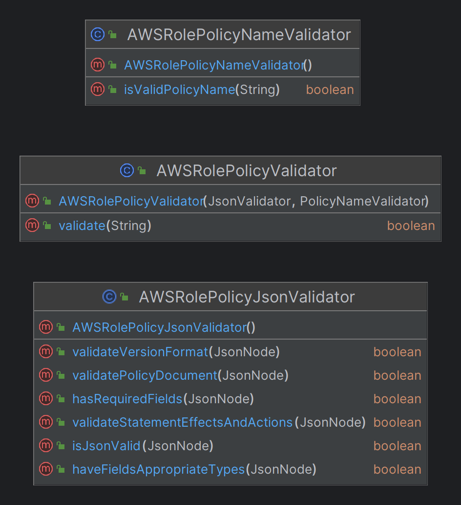

## How to use this README:
Click the symbol or summary to expand the topic you're interested in.
<details><summary><b>Tutorial</b></summary>
    <b>Have Fun!</b>

</details><br/>

### Go to: 
[Project Description]()
[How to run AWSIAM]()
[How to run AWSIAM - IDE]()
[How to run AWSIAM - Terminal]()
[Documentation]()

## Project Description 
<details><summary><b>Exercise</b></summary>
<div>
    
</div>
Exercise: 
Write a method verifying the input JSON data. Input data format is defined as AWS::IAM::Role Policy - definition and example (<a href="https://docs.aws.amazon.com/AWSCloudFormation/latest/UserGuide/aws-properties-iam-role-policy.html">AWS IAM Role JSON definition and example</a>). Input JSON might be read from a file. 
Method shall return logical false if an input JSON Resource field contains a single asterisk and true in any other case.

```diff
JSON 
    {
    "PolicyName": "root",
    "PolicyDocument": {
        "Version": "2012-10-17",
        "Statement": [
            {
                "Sid": "IamListAccess",
                "Effect": "Allow",
                "Action": [
                    "iam:ListRoles",
                    "iam:ListUsers"
                ],
                "Resource": "*"
            }
        ]
    }
}
```
## Tech Stack:
<details><summary><b>Stack</b></summary></details>

<div>
	
	
	
</div>
<ul>
    <li>Java Oracle OpenJDK version 21</li>
    <li>Maven 3 (Version 3.8.1)</li>
    <li>JUnit 4.13.2, junit.jupiter 5.10.2</li>
    <li>Jackson 2.17.0</li>
</ul>
<details><summary><b>Maven dependencies</b></summary>

#### [From MVN REPOSITORY](https://mvnrepository.com/)
[pom.xml](https://github.com/soberyoda/AWSIAM_Internship_2024/blob/main/Solution/pom.xml)
```diff
    <dependencies>
        <!-- JACKSON -->
        <dependency>
            <groupId>com.fasterxml.jackson.core</groupId>
            <artifactId>jackson-core</artifactId>
            <version>2.17.0</version>
        </dependency>
        <dependency>
            <groupId>com.fasterxml.jackson.core</groupId>
            <artifactId>jackson-databind</artifactId>
            <version>2.17.0</version>
        </dependency>
        
        <!-- JUnit -->
        <dependency>
            <groupId>junit</groupId>
            <artifactId>junit</artifactId>
            <version>4.13.2</version>
            <scope>test</scope>
        </dependency>
        <dependency>
            <groupId>org.junit.jupiter</groupId>
            <artifactId>junit-jupiter-api</artifactId>
            <version>5.10.2</version>
            <scope>test</scope>
        </dependency>
    </dependencies>
```
</details>
</details>

## How to run AWSIAM
### IDE

1. Clone GitHub repository
   [GitHub Docs - Cloning a repository](https://docs.github.com/en/repositories/creating-and-managing-repositories/cloning-a-repository)

2. Make sure that the required tools are installed on your computer.
<ul>
        <li><a href="https://www.oracle.com/java/technologies/downloads/#jdk21">JDK Development Kit 21</a></li>
        <li><a href="https://maven.apache.org/download.cgi">Apache Maven</a></li>
</ul>

3. Open the project in IntelliJ IDEA (preferred) or in another integrated development environment.
4. Go to the Main class <code>Solution/src/main/java/Main.java</code>, set the appropriate paths to your JSON file, and click 'Run'.

f.ex: 
```diff
public class Main {
    public static void main(String...args){
        String pathToJson = "Solution/src/main/resources/validJson.json"; <-- PATH TO YOUR JSON FILE
        JsonValidator jsonValidator = new AWSRolePolicyJsonValidator();
        PolicyNameValidator policyNameValidator = new AWSRolePolicyNameValidator();
        AWSRolePolicyValidator awsRolePolicyValidator = new AWSRolePolicyValidator(jsonValidator, policyNameValidator);
        System.out.println(awsRolePolicyValidator.validate(pathToJson));
    }
}
```
### Terminal
1. Download [Fat-jar](https://github.com/soberyoda/AWSIAM_Internship_2024/blob/main/Solution/Solution-1.0-SNAPSHOT-jar-with-dependencies.jar)
2. Make sure that the required tools are installed on your computer.
<ul>
        <li><a href="https://www.oracle.com/java/technologies/downloads/#jdk17">JDK Development Kit 17.0.10</a></li>
        <li><a href="https://maven.apache.org/download.cgi">Apache Maven</a></li>
</ul>

3. Open the terminal
4. Navigate to the location of the .jar file
5. run <code>java -jar Solution-1.0-SNAPSHOT-jar-with-dependencies.jar absolutePathToJsonFile</code>

```diff
public class Main {
    public static void main(String...args){
        String pathToJson = args[0];
        JsonValidator jsonValidator = new AWSRolePolicyJsonValidator();
        PolicyNameValidator policyNameValidator = new AWSRolePolicyNameValidator();
        AWSRolePolicyValidator awsRolePolicyValidator = new AWSRolePolicyValidator(jsonValidator, policyNameValidator);
        System.out.println(awsRolePolicyValidator.validate(pathToJson));
    }
}
```
Example result for validJson2.json:
```diff 
D:\AWSIAM_Internship_2024\Solution>java -jar Solution-1.0-SNAPSHOT-jar-with-dependencies.jar D:\AWSIAM_Internship_2024\Solution\src\test\java\resources\validJson2.json
true
```

## Documentation
<details>
<summary><b>Interfaces</b></summary>

</details>
<details>
<summary><b>Json package</b></summary>

</details>
<details>
<summary><b>AWSRolePolicy package</b></summary>

</details>
<details>
<summary><b>Project Diagram</b></summary>

</details>
<details>
<summary><b>Tests</b></summary>

### Caution! In some tests, it is necessary to change paths (absolute paths to JSON files). These tests are appropriately marked.
```diff
Solution/src/test/java/AWSRolePolicy/AWSRolePolicyValidatorTest.java

Solution/src/test/java/Json/JsonParserTest.java

Solution/src/test/java/Json/JsonPathValidatorTest.java
```

<details>
<summary><b><code>mvn test</code> results</b></summary>

</details>
</details>